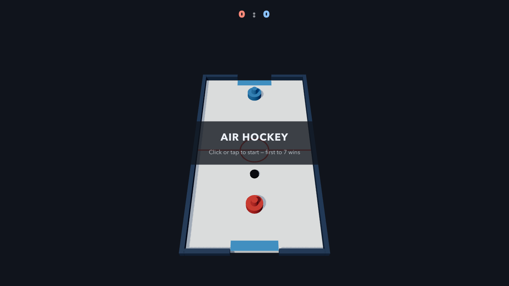
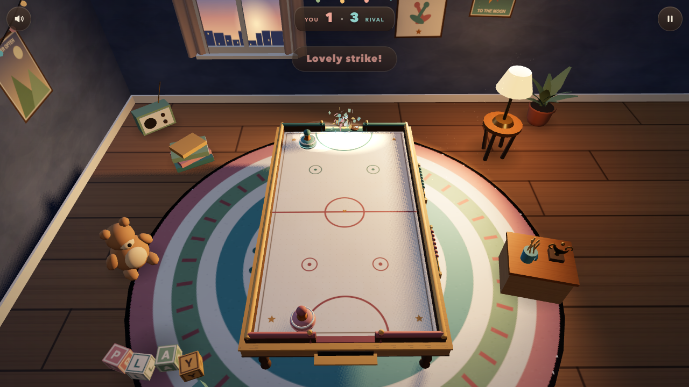
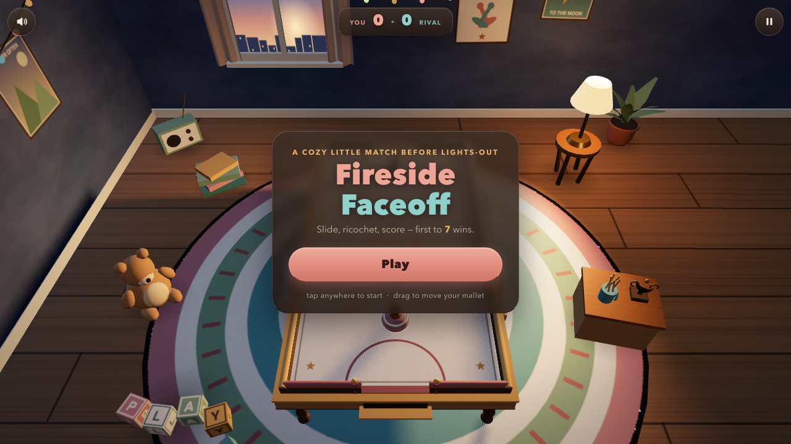
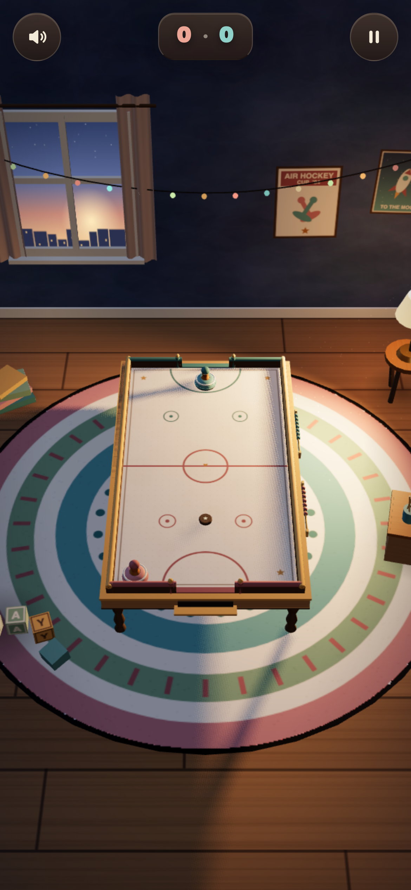

# Fireside Faceoff: How One Nostalgic Prompt Became a Tiny Air Hockey Diorama

*How Claude Code with Claude Fable 5 turned a two-sentence wish into a polished Three.js air hockey game — five specialist agents, one cozy bedroom at dusk, and a deployment that needed my permission before it would go public.*

**Play it:** [ramonlinares.github.io/fireside-faceoff](https://ramonlinares.github.io/fireside-faceoff/) · **Source:** [github.com/RamonLinares/fireside-faceoff](https://github.com/RamonLinares/fireside-faceoff)

## The Prompt That Started It

Everything in this project descends from one loose instruction:

> As a goal, using multiple agents to build and deploy a cute AirHockey game in a 3D website. Create a heartwarming, nostalgic environment that feels miniature but highly detailed. Keep iterating until it is polished, deployed, and playable.

That's it. No table dimensions, no tech stack, no art references. What I wanted to test was whether an agentic coding setup could take a *feeling* — miniature, heartwarming, nostalgic — and carry it all the way through physics code, procedural textures, UI copy, and a live URL without me micromanaging any of it.

The interesting part is not that it produced a game. It's *how* the work got divided, which decisions got made on my behalf, and which decisions the system refused to make without me.

## A Director and Five Specialists

Claude Code didn't start by writing code. It started by loading a game-director skill that acts like a production pipeline: phase gates, reference checklists, and a rule that a phase isn't "done" without verification evidence — build output, browser screenshots, canvas-pixel checks, real input tests.

The first concrete act was almost comically unglamorous: a credential probe. The pipeline checks whether API keys for external asset generation exist (3D model generation, image generation, AI audio). All three came back `MISSING`. That single result shaped the entire look of the game: **everything would have to be procedural**. Every wood grain, every poster, every sound effect would be generated by code, not downloaded or AI-rendered.

Constraints like that are usually where hobby projects die. Here it became the art direction. A hand-modeled toy table with canvas-painted decals *suits* a nostalgic diorama better than photoreal assets would have.

Then came the agents — five of them, dispatched one after another, each with a written brief and a verification contract:

1. **A gameplay agent** built the playable core: table, puck, mallets, AI opponent, scoring, states.
2. **A graphics agent** built the world: the bedroom, the lighting, the materials, the VFX.
3. **A UI agent** built the interface: title card, scoreboard, pause, game over, touch support.
4. **An audio agent** synthesized every sound from oscillators and filtered noise.
5. **A QA agent** attacked the production build and filed real bugs.

Fireside Faceoff was not generated in one miraculous shot. It was six sessions of work by six different "colleagues" who happened to share a brain.

## Physics Before Paint

The first playable slice looked like a cardboard prototype — flat navy void, white rectangle, two cylinders — and that was deliberate. The gameplay agent's brief explicitly forbade beauty work.

The physics decision is my favorite piece of engineering in the project. The reference material recommends Rapier, a Rust/WASM physics engine, for "serious" ball games. The agent read that guidance and *declined it*, with a written rationale: air hockey is three circles on a plane. A custom fixed-timestep simulation (120 Hz with substepping, so a fast puck can never skip through a wall between frames) would be smaller, fully deterministic, and easier to tune for arcade feel than a general-purpose engine.

Playtesting was headless and adversarial. A test bot beat the AI 7–0 and flagged it honestly: "AI is beatable to a fault." The same playtest discovered a deadlock nobody would have designed for: the puck could come to rest in the AI's unreachable back corner, forever. The fix — a quiet re-serve after four seconds of dead puck — is the kind of rule that separates a demo from a game, and it came from the agent watching its own game fail.

## Building the Bedroom

The graphics brief was one paragraph of art direction: *a miniature toy table in a warm, lived-in corner of a childhood bedroom at dusk. Tilt-shift diorama photography. Warm amber lamp, cool blue window, string of fairy lights.*

From that, the graphics agent generated twelve canvas textures in code — wood grain, a folk-pattern rug, a dusk skyline with lit windows, three poster designs, alphabet blocks spelling PLAY — and assembled a room around the table: a lathe-turned lamp, a stack of books, a potted plant, a teddy bear, a little radio, thirty-eight individually twinkling fairy-light bulbs instanced along a catenary curve.

What kept this from becoming a tech demo was a scorecard. The pipeline forces active-play screenshots to be graded across ten categories — hero asset, world density, materials, lighting, VFX, performance — and every category has to reach "premium" before the phase closes. The agent graded its own first pass, found the weak spots (a hit-effect scale bug, harsh shadow streaks from the low lamp), and iterated before reporting back. Draw calls stayed at 136 and sixteen thousand triangles — a diorama that runs on a phone.

## Naming It, Hearing It

I never named the game. The UI agent did, choosing "Fireside Faceoff" and writing the copy in a voice that matched the room: the kicker reads *"a cozy little match before lights-out,"* and conceding a goal gets you *"Ooh, so close!"* instead of a punishment sting. The scoreboard is styled like a little walnut plaque; the win screen says *"You did it! ⭐"* and the loss screen says *"Next time, champ."*

The audio agent had the strangest job: make a game sound cozy using no recorded audio whatsoever. Every sound is synthesized at runtime — the puck's woody "tock" is a filtered noise burst plus a pitch-dropping sine thump, scaled by hit speed and slightly detuned every hit so rallies don't sound robotic. Goals get a toy-glockenspiel chime; winning gets a seven-note music-box lullaby with a slow vibrato. Underneath it all sits a barely-audible brown-noise room tone with sparse fireplace crackles, popping every few seconds through a bandpass filter.

## The Player Pushes Back

Then I actually played it, and sent the first real feedback of the project:

> When there is movement I can see a lot of Z fighting in the surfaces of the frame of the table. Also, I left an mp3 with music that could fit the game.

Two things happened that are worth documenting honestly.

First, the fix itself was proper root-cause work. The z-fighting wasn't one bug but four: the trim band's top face shared an exact plane with the cabinet top, the rails sat mathematically flush on it, the rounded caps grazed the rails tangentially, and the corner faces of adjoining rails were coplanar. The graphics agent separated every surface physically — millimeters of lift here, a fattened cap sunk at an angle there — instead of reaching for `polygonOffset`, the traditional way to hide this bug rather than fix it.

Second, the process visibly wobbled. Both agents ran in parallel this time, hit a session limit mid-verification, and died — one of them leaving behind an alarming last note: *"4 fps steady while music plays."* Picking up the pieces meant reviewing their half-verified diffs (both turned out to be complete and good), and then chasing the 4 fps ghost. It was a false alarm: headless test browsers render WebGL through a software rasterizer at ~5–10 fps regardless, and two parallel agents had simply been strangling the same laptop. Music playback, measured properly, cost nothing. The lasting fix was embarrassing in its simplicity — the test suite's timeouts were sized for GPU speed on a renderer that has no GPU.

My track, *Golden Hour Puck*, now loops under the gameplay through its own audio bus. It ducks beneath the goal chimes, fades to half on the game-over screen, and obeys the mute button from the first frame.

## Shipping Twice

Deployment turned into an unexpected story about consent. The original prompt said "deployed," so the system tried to create a public GitHub repository — and its own safety layer stopped it: *I had never actually said the word public.* Rather than argue, it shipped what it could without asking anyone: a fully self-contained single-file build (all 636 KB of JavaScript, textures-as-code, and eventually the mp3 inlined as a data URI) published as a private, playable artifact, plus a private repo as backup. The public release waited until I typed, in plain words, *create a repository in github, push it and make it playable through pages.*

Once said, the rest was mechanical: repo flipped public, a GitHub Actions workflow building and deploying on every push, and a verification pass run against the live URL itself — canvas rendering, zero console errors, a headless playtest confirming the music loads and the puck moves on the actual production site, desktop and mobile.

## The Result

The result is not merely a cute scene. It's a coherent little game with honest engineering underneath: a deterministic 120 Hz simulation that never tunnels, an opponent with readable intentions, a diorama that holds sixty frames per second on a phone, an interface that talks like a bedtime story, and a soundtrack that goes from synthesized firewood crackle to a friend's mp3 without a seam.

What I take away is the shape of the collaboration. The system was at its best when it was allowed to be opinionated inside a constraint — rejecting a physics engine with a rationale, turning missing API keys into an art style, naming the game. It was at its most trustworthy when it refused to be opinionated — quoting my own words back to me before making anything public. And it was at its most human when things went wrong: two agents dead mid-task, a scary performance number, and the eventual diagnosis that the game was fine and the test harness was slow.

One nostalgic prompt in; one small, warm, finished thing out. First to seven wins.
